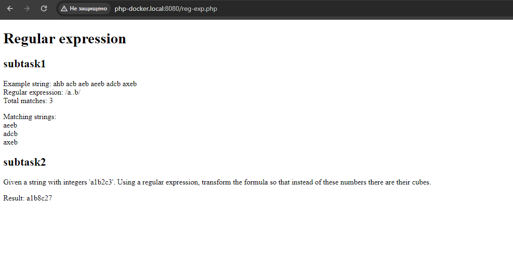
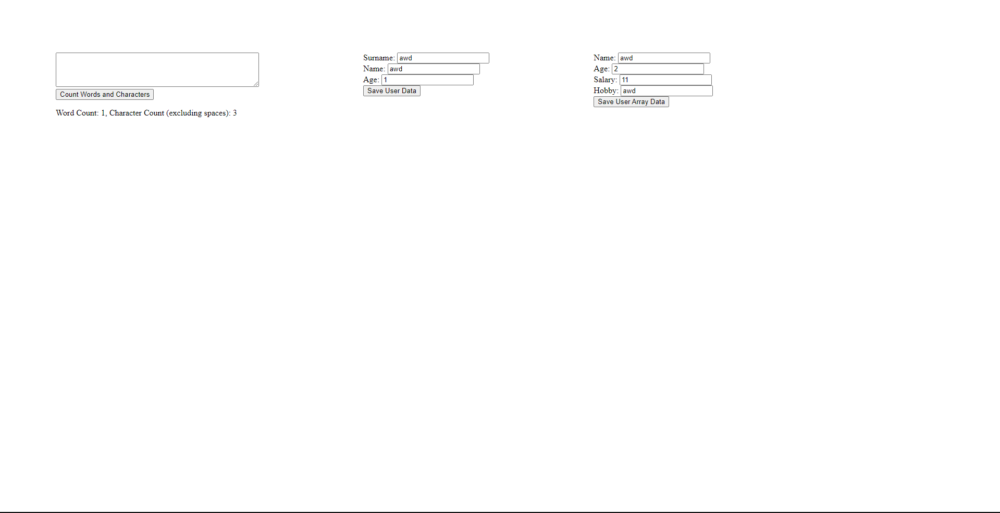
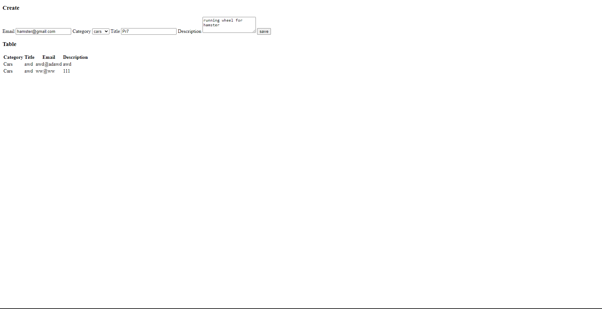

## Task1: Regular Expression
### Link: https://php-docker.local:8080/reg-exp.php

## Task2: Form. Sessions and Cookies
### Link: https://php-docker.local:8080/form.php

Output subtask1 + input subtask2-3:

And redirect on output subtask2-3:

## Task3: File
### Link: http://php-docker.local:8080/

